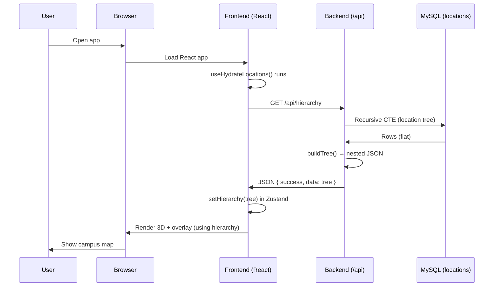
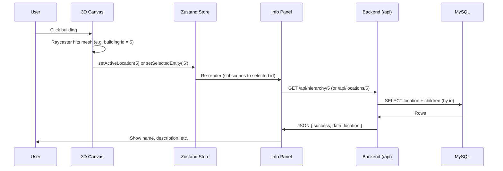
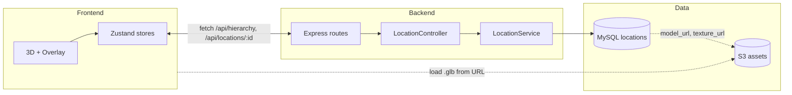

# Twin Campus Digital Twin — System Overview

**Purpose:** This document explains how the entire Twin Campus application works from frontend to backend when the system is complete. It aligns with the [Roadmap (Google Docs)](https://docs.google.com/document/d/1icT2Tj0TYQX61ZEUwnha_OgfHI69xuWfA-K5pQCM0vY/edit?usp=sharing) and the project’s Sprint 1 → Sprint 3 → Sprint 3 Week 2 direction.

**Audience:** Developers, stakeholders, and future contributors who want a clear, thorough picture of how the pieces fit together.

---

## 1. What Is Twin Campus?

**Twin Campus** is a web-based **Digital Twin** of a college campus: an interactive 3D map that users can explore in the browser. When complete, users will:

- See a 3D model of the campus (buildings, terrain, pathways).
- Click or hover over buildings to get more information.
- View an **Info Panel** with metadata (name, description, floor/room info) that comes from the backend.
- Navigate between an “outdoor” (campus-wide) view and eventually “indoor” (building/floor) views.

The **frontend** is responsible for rendering the 3D scene and UI. The **backend** is responsible for storing and serving the **location hierarchy** (Campus → Building → Floor → Room) and **metadata** so the frontend can show the right information at the right time. They work together: the frontend asks for data over HTTP; the backend reads from a database (and later from S3 URLs) and responds with JSON.

---

## 2. High-Level Architecture (When Complete)

When the system is fully built, the flow looks like this:

```
┌─────────────────────────────────────────────────────────────────────────────┐
│                              USER'S BROWSER                                  │
│  ┌───────────────────────────────────────────────────────────────────────┐  │
│  │  FRONTEND (React + Vite + React-Three-Fiber)                            │  │
│  │  • 3D Canvas (campus, buildings, camera)                                │  │
│  │  • Overlay UI (Info Panel, loading, controls)                            │  │
│  │  • State: Zustand (layers, location hierarchy, selectedEntity)          │  │
│  │  • On load: GET /api/hierarchy  →  store hierarchy                      │  │
│  │  • On click building: setSelectedEntity(id)  →  GET /api/locations/:id   │  │
│  │    →  Info Panel shows name, description, etc.                          │  │
│  └───────────────────────────────────────────────────────────────────────┘  │
│                                    │                                         │
│                          HTTP (fetch) to /api/*                              │
└────────────────────────────────────┼─────────────────────────────────────────┘
                                     │
                     ┌───────────────▼───────────────┐
                     │  CONNECTION POINT: API        │
                     │  Same origin or proxy         │
                     │  e.g. https://app.com/api     │
                     │  or dev: localhost:5173/api  │
                     │  → proxied to backend :3001   │
                     └───────────────┬───────────────┘
                                     │
┌────────────────────────────────────┼─────────────────────────────────────────┐
│  BACKEND (Node.js + Express)       │                                          │
│  • CORS for frontend origin        │                                          │
│  • GET /api/health                 │                                          │
│  • GET /api/hierarchy              │  ← Full tree (locations table)           │
│  • GET /api/hierarchy/:id         │  ← One location + children              │
│  • GET /api/hierarchy/flat        │  ← Flat list with paths                  │
│  • Business logic: LocationController → LocationService                      │
└────────────────────────────────────┼─────────────────────────────────────────┘
                                     │
              ┌──────────────────────┼──────────────────────┐
              │                      │                      │
              ▼                      ▼                      ▼
     ┌─────────────────┐   ┌─────────────────┐   ┌─────────────────┐
     │  MySQL          │   │  AWS S3         │   │  (Future)       │
     │  locations      │   │  .glb, textures │   │  Auth, etc.     │
     │  hierarchy +    │   │  (model_url     │   │                 │
     │  metadata       │   │   from DB)      │   │                 │
     └─────────────────┘   └─────────────────┘   └─────────────────┘
```

In plain language:

- The **browser** runs the React app (frontend). The app draws the 3D map and overlay.
- The frontend **connects** to the backend by making **HTTP requests** to URLs like `/api/hierarchy` and `/api/locations/5`. That is the only place the two “touch.”
- The **backend** is an Express server. It receives those requests, talks to **MySQL** (and later **S3** for file URLs), and sends back **JSON**.
- **MySQL** holds the **locations** table: one tree (Campus → Building → Floor → Room) plus metadata (name, description, position, `model_url`, etc.). The backend never stores the actual .glb files—only **pointers** (URLs) to files in **S3**.

---

## 3. Where Do the Frontend and Backend Connect?

**They connect at the first HTTP request from the frontend to the backend.**

### The exact moment

1. **On app load:** The React app mounts and runs `useHydrateLocations()` (in `App.tsx`). That hook calls `fetchLocationHierarchy()` from `src/api/hierarchyClient.ts`.
2. **First request:** `fetchLocationHierarchy()` does `fetch('/api/hierarchy')`. The browser sends an HTTP GET to the **same origin** as the page (e.g. `https://your-app.vercel.app/api/hierarchy` or, in dev, `http://localhost:5173/api/hierarchy`).
3. **Who handles it?**
   - **Production:** The same host often serves both the static frontend and the API (e.g. Vercel serverless or a reverse proxy that sends `/api/*` to the Node backend). So the “connection” is: browser → one domain → routing splits “page” vs “API” → backend handles `/api/*`.
   - **Development:** To avoid cross-origin issues, the frontend uses **relative** URLs (`/api`). You typically add a **Vite proxy** in `vite.config.ts` so that requests to `http://localhost:5173/api/*` are **forwarded** to `http://localhost:3001/api/*` where the Express server is running. So the connection point is: **first time the frontend calls `fetch('/api/hierarchy')` and that request is proxied to the backend.**

So:

- **Conceptually:** Frontend and backend connect at the **API boundary**—every `fetch('/api/...')` is that connection.
- **In time:** The **first** connection happens when the app loads and requests the hierarchy (e.g. `useHydrateLocations` → `GET /api/hierarchy`). Later, when the user clicks a building, the frontend sends **another** request (e.g. `GET /api/locations/:id`) to get details for the Info Panel.

### Why “same origin” or proxy?

- Browsers block many **cross-origin** requests unless the backend sends CORS headers. The backend is already set up with **CORS** for the frontend origin (e.g. `http://localhost:5173`).
- Using **relative** URLs (`/api`) and a **proxy** in dev keeps the code simple: the frontend always talks to “my same host, path /api,” and in dev the dev server forwards that to the backend. No need to hardcode `http://localhost:3001` in the frontend.

---

## 4. How the Backend Serves the Frontend (Step by Step)

The backend does **not** serve the React HTML/JS/CSS. Those are served by the **frontend host** (e.g. Vite in dev, Vercel in production). The backend **only** serves **data** in response to API requests.

### 4.1 What the backend serves

| Endpoint | Purpose | Used by frontend |
|----------|---------|-------------------|
| `GET /api/health` | Check if server and DB are up | Optional (e.g. status page or monitoring). |
| `GET /api/hierarchy` | Full location tree (nested JSON) | **Yes.** `useHydrateLocations` → `fetchLocationHierarchy()` loads this once and puts it in the location store. |
| `GET /api/hierarchy/:id` | One location and its children | **Yes.** Info Panel (or a React Query hook like `useBuildingMetadata(id)`) fetches details when user selects a building/location. |
| `GET /api/hierarchy/flat` | Flat list with path strings | Optional (e.g. breadcrumbs or search). |

So the backend “serves the frontend” in this sense: **it serves the JSON data that the frontend needs to know what to draw (hierarchy) and what to show in the Info Panel (metadata).**

### 4.2 Flow: Page load (hierarchy)



- The **first** time the frontend and backend “connect” in this flow is the **GET /api/hierarchy** request.
- The backend uses the **LocationController** (e.g. `getHierarchy`) and **LocationService** / raw queries to run a **recursive CTE** on the `locations` table, then converts the flat rows into a **nested tree** and returns it. The frontend stores that tree and uses it to know what locations exist and (when implemented) to map “clicked object” → location id → metadata.

### 4.3 Flow: User clicks a building (Info Panel)



- The frontend and backend **connect again** here when the panel (or a React Query hook) calls **GET /api/hierarchy/:id** (or the equivalent location-by-id endpoint).
- The backend returns one location and its children; the frontend shows that in the Info Panel.

---

## 5. Why the Backend Is Important

The backend is not just “a place that returns JSON.” It is the **single source of truth** for:

1. **Hierarchy and structure**  
   Which buildings exist, which floors and rooms belong to which building, and in what order. The frontend does not hardcode this; it loads it from **GET /api/hierarchy**.

2. **Metadata**  
   Name, description, floor number, room number, area, etc. When the user clicks a building, the frontend gets this from the backend so the Info Panel can show accurate, up-to-date information.

3. **Where things are (and how to load assets)**  
   The `locations` table stores position, rotation, scale, and **S3 URLs** (`model_url`, `texture_url`, `thumbnail_url`). So the backend tells the frontend *where* to place a building in 3D and *from where* to load the .glb (from S3). The frontend does not store big files; it follows URLs from the API.

4. **One place to update**  
   When the campus changes (new building, renamed room), you update the database (or future admin API). The frontend always gets the latest structure and metadata by calling the API. No need to redeploy the 3D app for content changes.

5. **Security and scaling**  
   The database is not exposed to the browser. Only the backend talks to MySQL (and S3); the browser only talks to the backend. That keeps credentials and logic on the server and makes it easier to add auth or rate limiting later.

So: **the backend is important because it owns the campus data and serves it to the frontend in a structured way; without it, the frontend would have no hierarchy or metadata to show, and no URLs for 3D assets.**

---

## 6. Data Flow Diagrams (When Complete)

### 6.1 Where data lives



- **Frontend** keeps UI state and a copy of the hierarchy in Zustand; it gets that data by calling the API.
- **Backend** reads from **MySQL** and returns JSON; the DB holds **pointers** (URLs) to **S3** for assets.
- The **frontend** loads 3D assets (e.g. .glb) directly from **S3** using those URLs; it does not get file bytes from the backend.

### 6.2 Recursive locations model (DB)

The database uses a **single** table, `locations`, with a **self-referencing** `parent_id`:

```mermaid
erDiagram
  locations {
    int id PK
    int parent_id FK "null = root (Campus)"
    enum type "Campus, Building, Floor, Room"
    string name
    string description
    decimal position_x,y,z
    decimal rotation_x,y,z
    decimal scale_x,y,z
    string model_url "S3 URL"
    string texture_url
    string thumbnail_url
    boolean is_visible
    boolean is_navigable
    ...
  }
  locations ||--o{ locations : "parent_id"
```

- **Campus** has `parent_id = NULL`.
- **Building** has `parent_id = Campus.id`.
- **Floor** has `parent_id = Building.id`.
- **Room** has `parent_id = Floor.id`.

The backend builds the tree (e.g. with a recursive CTE) and returns nested JSON so the frontend gets one tree structure, not four different tables.

---

## 7. End-to-End User Story (When Complete)

1. **User opens the app**  
   - Frontend loads (Vite/Vercel).  
   - React mounts, `useHydrateLocations()` runs.  
   - **First connection:** Frontend sends **GET /api/hierarchy** (via same origin or proxy).  
   - Backend reads `locations` from MySQL, builds tree, returns JSON.  
   - Frontend stores tree in Zustand and renders the 3D scene (and overlay).

2. **User sees the campus**  
   - Buildings/terrain are drawn using the hierarchy and positions from the tree (and optionally `model_url` for per-building .glb from S3).

3. **User clicks a building**  
   - Raycaster hits the building mesh; frontend gets location id.  
   - Frontend calls `setActiveLocation(id)` (or `setSelectedEntity(id)`).  
   - Info Panel subscribes to that id and calls **GET /api/hierarchy/:id** (or **GET /api/locations/:id**).  
   - **Second connection:** Backend returns that location and its children.  
   - Panel shows name, description, floor/room, etc.

4. **User closes the panel**  
   - Frontend sets selected id to `null`; panel hides. No new API call needed.

So the backend is involved at **page load** (hierarchy) and on **each selection** (location details). Everything else (rendering, camera, layers) is frontend-only.

---

## 8. Current State vs “When Complete”

| Piece | Current state | When complete |
|-------|----------------|----------------|
| **Backend entry** | `server.js` runs; only `/api/health` and `/api/buildings` are mounted. | Location routes mounted in `server.js` (or single app entry): `GET /api/hierarchy`, `GET /api/hierarchy/:id`, etc. |
| **First connection** | Frontend calls `GET /api/hierarchy` from `useHydrateLocations`, but that route is **not** exposed by `server.js`, so the request 404s unless you run the alternative `app.js`. | Proxy (dev) or same-origin (prod) forwards `/api` to backend; **GET /api/hierarchy** returns the tree. |
| **Location store** | `useLocationStore` exists (hierarchy, activeLocationId, hoveredLocationId, setHierarchy, setLoading, setError). | Same store; plus selectors and Info Panel subscribing to selected id. |
| **Info Panel** | Not built. | Overlay + Info Panel component; fetches **GET /api/hierarchy/:id** (or locations/:id) when user selects a building. |
| **3D interaction** | Debug cube has pointer events; no raycaster on buildings yet. | Raycaster + interaction wrapper set selected id; panel shows metadata from API. |
| **Assets** | Greybox from `public/models/`; no S3. | DB has `model_url` (S3); frontend loads .glb from S3 when present. |

---

## 9. Summary: How It All Fits Together

- **Frontend:** React + R3F for 3D; Zustand for state; overlay for UI. It **requests** hierarchy and location details from the backend over HTTP.
- **Backend:** Express API that **serves** that data from MySQL (and points to S3 for assets). It does not serve the React app; it only serves JSON.
- **Connection point:** The frontend and backend connect at **every API request**. The **first** connection is usually **GET /api/hierarchy** when the app loads; the **next** connections are **GET /api/hierarchy/:id** (or equivalent) when the user selects a location and the Info Panel fetches details.
- **Why backend matters:** It is the single source of truth for hierarchy and metadata, keeps the DB and S3 behind the server, and lets you change content without redeploying the 3D app.

For the roadmap: finishing **Sprint 3** (mount Location routes in `server.js`, ensure hierarchy and location-by-id work) and **Sprint 3 Week 2** (overlay, Info Panel, raycasting, store actions) will bring the system to the “when complete” behavior described in this document.
